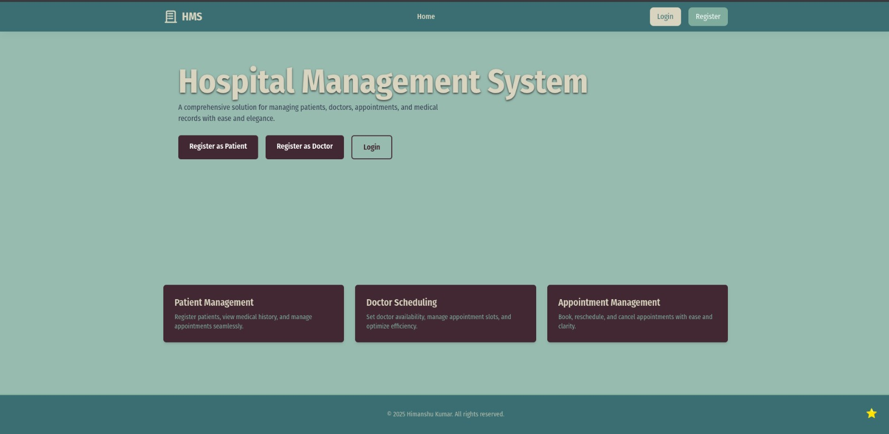

# HMS - Hospital Managment System System

[](https://opensource.org/licenses/MIT)
[](https://nodejs.org/)
[](https://www.mysql.com/)




A secure and scalable registration system for medical professionals and patients with email verification and authentication features.

## Features

- **Dual Registration System**
  - Separate registration flows for Doctors and Patients
  - Google email validation (@gmail.com & @googlemail.com)
  - Secure password hashing with bcrypt
  
- **Email Verification**
  - SendGrid integration for verification emails
  - Token-based email verification
  - Resend verification email functionality

- **Authentication**
  - JWT-based authentication
  - Role-based access control
  - Secure session management

- **Advanced Features**
  - State & City selection with dynamic dropdowns
  - Comprehensive error handling
  - Responsive UI components
  - API rate limiting
  - Database transaction management

## Tech Stack

**Backend:**
- Node.js / Express.js
- MySQL
- Bcrypt.js
- JWT

**Frontend:**
- React.js
- TypeScript
- react-hook-form
- react-router-dom
- Tailwind CSS

## Installation

### Prerequisites
- Node.js v18+
- MySQL 8.0+

1. **Clone Repository**
   ```bash
   git clone https://https://github.com/himanshYou2003/HMS.git
   cd HMS